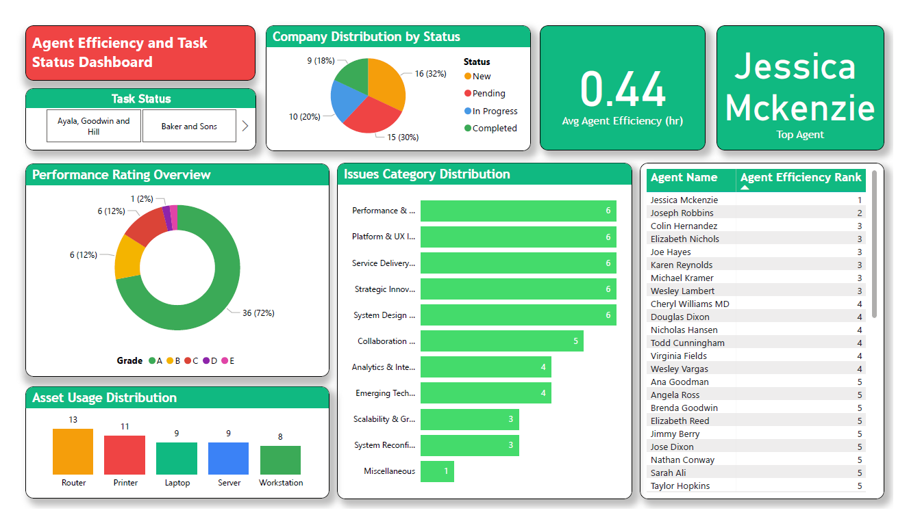

# Agent Efficiency and Task Status Dashboard

This Power BI dashboard visualizes agent performance and task status across multiple companies. It enables data-driven decision-making by highlighting agent efficiency, task progress, and issue categorization.

---

## 📊 Dashboard Features

- **Agent Efficiency Ranking**: Identifies top-performing agents based on average task completion time.
- **Task Status Overview**: Shows current distribution of tasks by status (New, Pending, In Progress, Completed).
- **Performance Rating Overview**: Grade distribution of agents' ratings.
- **Issue Category Distribution**: Highlights categories causing operational bottlenecks.
- **Company Task Distribution**: Tracks how different companies are progressing.
- **Asset Usage Distribution**: Indicates resource utilization across assets (Router, Printer, etc.).

---

## 📁 Files Included

- `agent-efficiency-dashboard.png` - Preview image of the dashboard.

---

## 💡 Tools & Skills Demonstrated

- Power BI
- Data Modeling
- DAX (Data Analysis Expressions)
- Dashboard Design & Interactivity
- Slicers and Drill-through filters

---

## 📌 Use Case

This dashboard can be used by operations teams, project managers, and support supervisors to monitor task progress and improve workforce efficiency through actionable insights.
